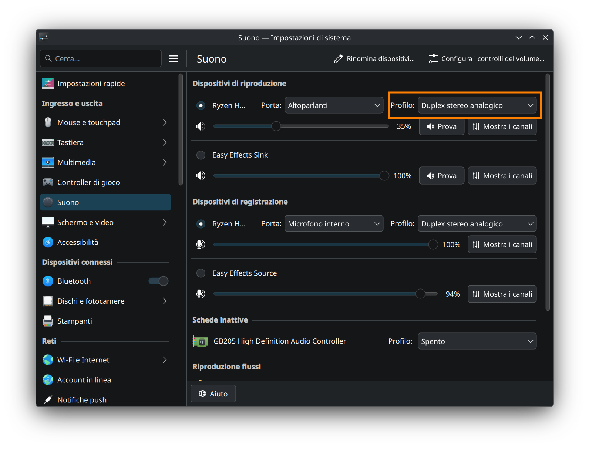

# Legion Pro 7/7i Gen 10 Linux Audio Driver
[](https://github.com/marco-giunta/legion-pro7-gen10-audio/actions/workflows/build_kernel.yml)

> Patched Linux audio drivers for Lenovo Legion Pro 7/7i Gen 10 (AMD & Intel). Includes Fedora RPM packages and installation automation. [mt7927 community patch](https://github.com/jetm/mediatek-mt7927-dkms) also included to enable Wi-Fi and Bluetooth on the AMD model.

Recent Lenovo Legion laptops control their woofers using the AWDZ88399 Smart Amp via i2c bus, in a setup that requires an HDA side codec driver which currently doesn't exist in the mainline Linux kernel. Due to this, on the current stock Linux kernel, the woofers don't work, and as a result the speakers lack bass and overall sound quiet and tinny.
This repository provides kernel patches and pre-built RPM packages to restore full audio functionality.

**Supported Models**
- Lenovo Legion Pro 7i Gen 10 (16IAX10H) - Intel
- Lenovo Legion Pro 7  Gen 10 (16AFR10H) - AMD

Other Legion models may also benefit from this patch despite being currently unsupported; for example, [Nadim's repo](https://github.com/nadimkobeissi/16iax10h-linux-sound-saga) contains some examples of this patch working on other Legion models. To check if this patch also applies to other laptops, read step 0 of the "manual install" section and the "Will this patch work on other laptops?" FAQ entry below.

**Credits & Attributions**

*Audio patch*: This work builds upon the [original Intel audio fix](https://github.com/nadimkobeissi/16iax10h-linux-sound-saga) by **Lyapsus**, **Nadim Kobeissi**, and contributors. Their incredible work made this project possible.

*mt7927 patch*: all credit goes to [jetm and contributors](https://github.com/jetm/mediatek-mt7927-dkms).

More detailed credits are available at the bottom of this page.

**What's new in this fork:**
- **Full AMD platform support** (16AFR10H)
- **Automated Fedora RPM builds** via GitHub Actions
- **Installation wizards** and automation scripts
- **Comprehensive self-compile guide** for Fedora
- **[mt7927 community patch](https://github.com/jetm/mediatek-mt7927-dkms)** to enable Wi-Fi and Bluetooth on the AMD model
- **easyeffects profiles** to restore some Windows-like features

***AI disclaimer:*** Especially in the earlier stages of this project, I relied on claude.ai for help with things I didn't fully understand; as I learned more about Linux and audio, I became more confident and less reliant on those tools. I can attest that ***all the code I added to the original patch was written by me, based on existing Linux code and documentation*** (see e.g. [here](https://github.com/nadimkobeissi/16iax10h-linux-sound-saga/issues/30#issuecomment-4176726805)). Likewise, ***the guides and tools in this repo were written and tested by me, based on official Fedora documentation***.
I still use AI for brainstorming or assistance with bugs; for example, Claude helped me fix or improve some parts of the GitHub Actions pipeline and the install script. These changes were limited to bugfixes or minor improvements; the overall logic and design are my own. Most importantly, it had no role in writing the actual kernel patch code.
More generally, Claude was part of how I learned (alongside reading documentation and experimenting on my hardware), but the end result reflects my own understanding and work. Therefore, while everything distributed in this repository is human-written, I think it's only fair to acknowledge the role LLMs played in getting there.

***Responsibility disclaimer:*** Although I tested everything on my own hardware and at my own risk, and can attest everything works, this software is provided *as is*. Use it at your own risk; I take no responsibility for any damage or issues that may occur.

---

# Install guide
## Before You Begin
### Patched kernel RPMs compatibility
The install instructions below assume you're using Fedora and installing the patched kernel using the prebuilt RPMs from this repo. If you're on a different Linux distro or prefer to compile your own kernel RPMs, see the FAQ for manual patching instructions.

The automated install script only supports stock Fedora. On Fedora derivatives, the manual install instructions should still work, but you may need to adapt the steps described there.

### Secure Boot 
The precompiled kernel distributed in this repo is unsigned, unlike the stock Fedora one. If Secure Boot is enabled, attempting to boot the patched kernel from GRUB will result in a black screen. 
The same applies to NVIDIA drivers: since they are not part of the kernel and are unsigned by default, they will also be blocked by Secure Boot and cause the same issue.

Because of this, Secure Boot must either be disabled or properly configured before the patched kernel or NVIDIA drivers can be used.

*Recommended approach*:
1. Disable Secure Boot in the BIOS;
2. Install the patched kernel and NVIDIA drivers, and verify that the system boots correctly;
3. Optionally, sign the kernel and drivers, then re-enable Secure Boot (see the "optional post-installation steps" section for instructions).

> ⚠️ If you dual boot Windows, ***before changing any BIOS setting***, go to https://account.microsoft.com/devices/recoverykey and make sure you have your BitLocker recovery key saved and noted down. Windows will ask for it after every BIOS change, so make sure you're not locked out.

## Installation guides
There are two main ways to install the patched kernel on Fedora.
### Automated Installation
The easiest method is to run the automated wizard:
```bash
curl -fsSL https://raw.githubusercontent.com/marco-giunta/legion-pro7-gen10-audio/legion_audio/scripts/install.sh | sudo sh
```

This script will guide you through installing the required firmware, the NVIDIA drivers from the RPM Fusion nonfree repo, and the patched kernel's RPMs.
If you wish to customize the install (for example, to install the proprietary NVIDIA driver from a different repo, or to use open source ones instead), please refer to the "manual installation" section below.

After the script is done, reboot; your system should automatically boot the patched kernel. You can confirm this by running `uname -r`; if you see a string containing the word `legion`, you're good to go. Otherwise, reboot your computer and repeatedly press the ESC key during boot to access the grub menu. You'll find an entry labeled `<...>.legion<...>.fc<...>.x86_64`; select it with the up/down keys, then press enter.

***Post-install:*** after you successfully installed the patched kernel, go to your OS sound settings, and ensure the ***Analog stereo duplex*** sound profile is selected (any other will disable the mic or some/all speakers). For example, here's how to do this in KDE Plasma:


If you own the Intel model, you can optionally set (e.g. with `grubby`) the `snd_intel_dspcfg.dsp_driver=3` boot parameter. This has the effect of making those spurious audio profiles disappear, leaving only the correct one in place; this profile will also be renamed to the less ambiguous name "play HiFi music".
However, this is mostly a cosmetic change, so if in doubt, ignore this boot parameter and just set the duplex profile as shown in the above screenshot.

### Manual installation
If you'd rather not run an automated script, follow the steps below to install everything manually; these are functionally equivalent to the install wizard.

0. **Verify your device is supported**

Check your SSID:
```bash
grep -l "Codec: Realtek" /proc/asound/card*/codec#* | xargs grep -i "Subsystem Id"
```
You should see a line like `Subsystem Id: 0x17aa<...>`, where `<...>` equals 4 characters. These are the IDs currently supported by the patch:
- `0x17aa3906`, `0x17aa3907`, `0x17aa3d6c` - Legion Pro 7i Gen 10 (16IAX10H, Intel)
- `0x17aa3938`, `0x17aa3939` - Legion Pro 7 Gen 10 (16AFR10H, AMD)

If your ID matches one of these, proceed to step 1.

If your ID is not listed, but
```bash
cat /sys/class/dmi/id/product_family
```
returns a string containing `16AFR10H` or `16IAX10H`, your Legion has an undiscovered hardware revision. In this case, please open an issue and paste the output of these commands, and I will add the missing SSID to the patch.

If you don't get a matching SSID and your laptop is a different model (or even from a different manufacturer), please check the "Will this patch work on other laptops?" FAQ entry.

1. **Install the firmware**
- Download the [`aw88399_acf.bin` file](firmware/aw88399/aw88399_acf.bin); alternatively, you can extract the binary yourself from the Windows driver by following the instructions in the [firmware extraction guide](docs/firmware_extraction.md).
- *Optional but recommended:* Download the [`aw88399_acf.bin.sha256`](firmware/aw88399/aw88399_acf.bin.sha256) file, put it in the same folder as the downloaded `aw88399_acf.bin`, and check the integrity of the binary:
```bash
# run this in the folder containing both the .bin and the .bin.sha256 files
sha256sum -c aw88399_acf.bin.sha256
```
If this doesn't return "OK", it means either file got corrupted in the download.
- Install the firmware by copying the `aw88399_acf.bin` file to `/lib/firmware/aw88399_acf.bin`:
```bash
sudo cp -f aw88399_acf.bin /lib/firmware/aw88399_acf.bin
```
- If you own the AMD model and wish to enable Wi-Fi and Bluetooth using jetm's [mt7927 patch](https://github.com/jetm/mediatek-mt7927-dkms), also install [BT_RAM_CODE_MT6639_2_1_hdr.bin](firmware/mt7927/BT_RAM_CODE_MT6639_2_1_hdr.bin), [WIFI_MT6639_PATCH_MCU_2_1_hdr.bin](firmware/mt7927/WIFI_MT6639_PATCH_MCU_2_1_hdr.bin), and [WIFI_RAM_CODE_MT6639_2_1.bin](firmware/mt7927/WIFI_RAM_CODE_MT6639_2_1.bin):
```bash
# check sha256 checksums
sha256sum -c BT_RAM_CODE_MT6639_2_1_hdr.bin.sha256
sha256sum -c WIFI_RAM_CODE_MT6639_2_1.bin.sha256
sha256sum -c WIFI_MT6639_PATCH_MCU_2_1_hdr.bin.sha256
```

```bash
# install wifi firmware
sudo mkdir -p /lib/firmware/mediatek/mt7927
sudo cp -f WIFI_MT6639_PATCH_MCU_2_1_hdr.bin /lib/firmware/mediatek/mt7927
sudo cp -f WIFI_RAM_CODE_MT6639_2_1.bin /lib/firmware/mediatek/mt7927
# install bt firmware
sudo cp -f BT_RAM_CODE_MT6639_2_1_hdr.bin /lib/firmware/mediatek/mt7927
```
To obtain your own copy of these Mediatek binaries from official Windows drivers, you can use the scripts in [jetm](https://github.com/jetm/mediatek-mt7927-dkms)'s repo.


2. **Install the NVIDIA driver builder**

The `akmod-nvidia` package is needed to automatically build the NVIDIA driver for the patched kernel. This package builds the driver as distributed in the nonfree RPM Fusion repo, and is [the standard approach on Fedora](https://rpmfusion.org/Howto/NVIDIA) and what this guide assumes.

> Skip this step if you prefer the open source Mesa/NVK driver, want to obtain the proprietary driver from a different repo, or are on a Fedora derivative that already manages the NVIDIA driver for you. Since the patch only touches audio (and optionally WiFi/BT on the AMD model), there's no fundamental reason why a different graphics setup shouldn't work; however, alternative paths are untested, so you're on your own. Feel free to open an issue if you run into anything useful to share. If you're unsure, just follow the steps below.


Run the following command:
```bash
rpm -qa | grep akmod-nvidia
```
If you see `akmod-nvidia-<...>.x86-64` the package is already installed and you can skip to step 3; otherwise:
- Enable the free and nonfree RPM Fusion repositories if you haven't already:
```bash
sudo dnf install https://download1.rpmfusion.org/free/fedora/rpmfusion-free-release-$(rpm -E %fedora).noarch.rpm
sudo dnf install https://download1.rpmfusion.org/nonfree/fedora/rpmfusion-nonfree-release-$(rpm -E %fedora).noarch.rpm
```
- install the `akmod-nvidia` package:
```bash
sudo dnf install akmod-nvidia
```
3. **Obtain the kernel RPMs**
- Head to the [releases section](https://github.com/marco-giunta/legion-pro7-gen10-audio/releases) and download the latest kernel available. Alternatively, you can compile your own patched kernel in RPM format using my [self compile guide](docs/self_compile.md).
- *Optional but recommended:* download the corresponding sha256 checksum and check the integrity of the downloaded file:
```bash
sha256sum -c legion-pro7-audio-*.tar.gz.sha256
```
- Unpack the archive and install the RPMs:
```bash
tar xzf legion-pro7-audio-*.tar.gz
sudo dnf install --nogpgcheck kernel-*.rpm
```
The patched kernel will now be available in the grub menu. If you installed the `akmod-nvidia` package in step 2, before rebooting, run
```bash
sudo akmods --force
```
and wait for it to confirm that the NVIDIA driver for the patched kernel has been built successfully.

4. **Post install**
- After rebooting, verify the installation:
```bash
# Check kernel version
uname -r
# Should contain the word "legion"

# List installed custom kernels
rpm -qa | grep legion

# Test audio
speaker-test -c 2 -t wav
```
The same rule stated in the previous section applies: ensure you select the analog stereo duplex profile (or enable the boot parameter on the Intel model), and you're good to go!

## Optional Post-installation Steps

### Secure Boot
TODO: add secure boot guide. In the meantime, see links in [issue #1](https://github.com/marco-giunta/legion-pro7-gen10-audio/issues/1)

### Set the patched kernel as persistent default
If you keep both the patched and stock kernels installed (recommended), every time Fedora ships a kernel update, the stock kernel will silently reclaim the default GRUB boot entry. Because of this, the patched kernel will no longer automatically boot, and you'll have to select it manually from the GRUB boot menu on every startup. The fix below automatically re-asserts the patched kernel as default after every kernel install.

[All credit for this fix goes to GitHub user mikaeldui.](https://gist.github.com/mikaeldui/bf3cd9b6932ff3a2d49b924def778ebb)

1. Create the post-install script:
```bash
sudo mkdir -p /etc/kernel/postinst.d
sudo nano /etc/kernel/postinst.d/99-default
```

2. Paste the following inside the terminal:
```bash
#!/bin/sh

set -e

grubby --set-default=/boot/$(ls -v /boot | grep vmlinuz.*legion | tail -1)
```
Save the script with `CTRL+X`, followed by `y`, then `ENTER`.

3. Set the correct ownership and permissions:
```bash
sudo chown root:root /etc/kernel/postinst.d/99-default
sudo chmod u+rx /etc/kernel/postinst.d/99-default
```

These steps have to be performed only once. You can verify the default kernel at any time by running `sudo grubby --default-kernel`; the output should contain the word `legion`.

### Echoing jack issue fix
While headphones are plugged in the jack port, if both music is playing and the mic is recording (e.g. you are on a discord call while playing a game), if the output volume is high enough, the mic will pick up a quieter copy of the signal being played, causing an annoying echo (quiet but audible). [Based on my findings](https://github.com/nadimkobeissi/16iax10h-linux-sound-saga/issues/34#issuecomment-4176480130), this is a hardware limitation that Windows fixes with clever proprietary software that cannot be easily replicated 1:1 under Linux. To fix this issue, you have two options:
- Use a jack to usb adapter, as the usb ports use different electronics and are unaffected by this issue;
- Install easyeffects and import my [echo canceling profile](easyeffects/echo_canceling.json), which is designed to approximate what I think Windows is doing. On one hand, this profile completely kills off the echo, but on the other, voice clarity and words intellegibility decrease compared to when there is no sound being played during the recording. In simple scenarios, the overall performance should be acceptable; however, please be aware that results may vary, especially if the easyeffects profile is being stacked on top of other software with independent signal processing (e.g. discord's default noise canceling/autogain settings). You're welcome to experiment with different easyeffects settings (if you find a better solution, please open an issue and let me know), but if the performance isn't up to par for your use case, it's probably easier to just rely on a usb adapter.

If you want to use easyeffects, I recommend using the flatpak version, as it already comes with all the necessary plugins and is guaranteed to be up to date (e.g. Fedora still ships the old GTK version). 
While easyeffects is running, you will see devices called "Easy Effects Sink" and "Easy Effects Source" pop up in your sound settings; do *not* select them, as easyeffects is designed to automatically hijack the default devices.

### Improved speakers loudness
If you want to make the speakers a bit louder, you can import my [loudness profile](easyeffects/loudness.json); this is useful to make perceived volume closer to Windows. 
This profile simply applies a slight boost, designed to make lower volume levels more usable. Feel free to increase the boost amount, but don't overdo it to avoid damaging the speakers.

### Screaming speakers issue
If you use live monitoring applications (like reaper or audacity) with the headphones unplugged, and have both the speakers and the internal mic active, as long as either volume is high enough, the speakers will start emitting an annoying high pitch sound due to a feedback loop of echoing signals. Just like the echoing jack issue, this is a hardware limitation that Windows solves using proprietary software. It's possible that this may be fixed using another easyeffects profile (e.g. a notch filter), but given that is quite a niche scenario, I'd recommend just using headphones if this is your use-case; this will remove the spurious signal and completely solve the issue.

## FAQ
### Can I use this on other Linux distros?
The prepackaged RPMs are Fedora-specific. For other distros, follow the steps in [Nadim's repo](https://github.com/nadimkobeissi/16iax10h-linux-sound-saga) to compile the Linux kernel without relying on Fedora specific tools.

Please notice that, if you have the AMD model, the same
```
CONFIG_SND_HDA_SCODEC_AW88399=m
CONFIG_SND_HDA_SCODEC_AW88399_I2C=m
CONFIG_SND_SOC_AW88399=m
```
config parameters as for the Intel models are needed, but not the Intel-specific ones; use the AMD specific ones instead. The ones used by Fedora are shown in the table below; however, given that a) not all of them are actually used, b) you also need other audio related parameters (e.g. the alc269 codec), and c) most distros build their kernels with every config already included to maximize hardware compatibility, I recommend you just use the same parameters used to compile the kernel you already have. In practice, this means going to `/boot`, copying the appropriate `config-<kernel version>` file, and appending the `CONFIG_SND_HDA_SCODEC_AW88399=m` and `CONFIG_SND_HDA_SCODEC_AW88399_I2C=m` parameters (`CONFIG_SND_SOC_AW88399=m` will realistically already be there, as well as everything else you need for both the Intel and AMD models).
<details>
<summary>AMD audio config parameters (click here)</summary>

```bash
CONFIG_SND_SOC_AMD_ACP=m
CONFIG_SND_SOC_AMD_CZ_DA7219MX98357_MACH=m
CONFIG_SND_SOC_AMD_CZ_RT5645_MACH=m
CONFIG_SND_SOC_AMD_ST_ES8336_MACH=m
CONFIG_SND_SOC_AMD_ACP3x=m
CONFIG_SND_SOC_AMD_RV_RT5682_MACH=m
CONFIG_SND_SOC_AMD_RENOIR=m
CONFIG_SND_SOC_AMD_RENOIR_MACH=m
CONFIG_SND_SOC_AMD_ACP5x=m
CONFIG_SND_SOC_AMD_VANGOGH_MACH=m
CONFIG_SND_SOC_AMD_ACP6x=m
CONFIG_SND_SOC_AMD_YC_MACH=m
CONFIG_SND_AMD_ACP_CONFIG=m
CONFIG_SND_SOC_AMD_ACP_COMMON=m
CONFIG_SND_SOC_ACPI_AMD_MATCH=m
CONFIG_SND_SOC_AMD_ACP_PDM=m
CONFIG_SND_SOC_AMD_ACP_LEGACY_COMMON=m
CONFIG_SND_SOC_AMD_ACP_I2S=m
CONFIG_SND_SOC_AMD_ACPI_MACH=m
CONFIG_SND_SOC_AMD_ACP_PCM=m
CONFIG_SND_SOC_AMD_ACP_PCI=m
CONFIG_SND_AMD_ASOC_RENOIR=m
CONFIG_SND_AMD_ASOC_REMBRANDT=m
CONFIG_SND_AMD_ASOC_ACP63=m
CONFIG_SND_AMD_ASOC_ACP70=m
CONFIG_SND_SOC_AMD_MACH_COMMON=m
CONFIG_SND_SOC_AMD_LEGACY_MACH=m
CONFIG_SND_SOC_AMD_SOF_MACH=m
CONFIG_SND_SOC_AMD_SDW_MACH_COMMON=m
CONFIG_SND_SOC_AMD_SOF_SDW_MACH=m
CONFIG_SND_SOC_AMD_LEGACY_SDW_MACH=m
CONFIG_SND_AMD_SOUNDWIRE_ACPI=m
CONFIG_SND_SOC_AMD_RPL_ACP6x=m
CONFIG_SND_SOC_AMD_ACP63_TOPLEVEL=m
CONFIG_SND_SOC_AMD_SOUNDWIRE_LINK_BASELINE=m
CONFIG_SND_SOC_AMD_SOUNDWIRE=m
CONFIG_SND_SOC_AMD_PS=m
CONFIG_SND_SOC_AMD_PS_MACH=m
```

</details>

Nadim's repo includes a section on how to extract the same list of parameters using `/proc/config.gz`. This is functionally equivalent to copying `/boot/config<...>` as described above, but the latter method is more universal, as the `/proc/config.gz` file doesn't exist on every distro (for example, Fedora doesn't include it).

### Can I build my own kernel RPMs on Fedora?
If you wish to compile your own kernel under Fedora Linux, I recommend using my [Fedora specific self-compile guide](docs/self_compile.md) over the [original](https://github.com/nadimkobeissi/16iax10h-linux-sound-saga), as it will make the process much easier: thanks to `fedpkg`, there is no need to manually pick kernel parameters, setup NVIDIA drivers, generate the initramfs, update the grub menu, or copy the files needed to install the patched kernel.

There exist multiple ways to compile the Linux kernel under Fedora (with some guides you can find online based on older methods); I recommend the approach detailed in my guide because it's the most up to date, high level, and beginner-friendly, as well as being based on the latest official method recommended by the Fedora docs themselves (see the guide for Fedora docs sources).

### Will this overwrite the stock kernel?
No. The original kernel remains installed unless you manually remove it, *which you never should*; it's recommended to always keep a backup. You can select which kernel to boot from the GRUB menu (quickly press ESC repeatedly during boot).

### How do I update to a newer kernel version?
Simply re-run the install script; it will automatically download and install the latest kernel built by GitHub Actions, while skipping the pre- and post- install steps that have been already completed.

Alternatively, download and extract the updated tarball, then run the same `dnf install --nogpgcheck` command detailed in the "manual install" section above; anything else (like installing the firmware, installing the NVIDIA package, and setting the correct audio profile) has to be done only once, no need to repeat those steps.

### How do I remove an older version of the patched kernel?
The recommended way to uninstall old kernel builds is to do nothing at all: by default, Fedora keeps around three kernels as fallback, so when you install a new one, the oldest will be removed.

To manually remove a kernel, you can use `dnf remove` on all the RPM packages that were installed by the wizard or you, which you can find using `rpm -qa | grep legion`. Another (slightly faster) way to remove all these packages is by using `dnf history undo` on the original transaction (check which number you need using `dnf history list`). 
Keep in mind that `dnf` prevents the user from removing the kernel currently in use for obvious reasons, so if you want to remove an older install, ensure you do this after booting another kernel from the grub boot menu.

### Do I need to reinstall after Fedora updates?
Regular Fedora updates won't affect the custom kernel. However, when new kernel versions are released, you may want to install updated versions from this repository for the latest features and security fixes.

### Where does the firmware come from?
See the [Firmware Extraction Guide](docs/firmware_extraction.md) for details on how `aw88399_acf.bin` was extracted from the Windows driver, and how you can extract it yourself if you wish to do so.

### How do I know this is safe?
- All builds are automated via [this GitHub Actions pipeline](.github/workflows/build_kernel.yml); the RPMs available here were *not* uploaded manually by me. You can check the building process in detail by clicking on the *Actions* button at the top of the page, or by clicking [here](https://github.com/marco-giunta/legion-pro7-gen10-audio/actions).
- Patches are publicly visible in [`patches/`](patches/).
- You can [build the patched kernel yourself](docs/self_compile.md) to verify.

### Black screen issues
If you see a black screen with a cursor or bar in the top left corner after selecting the patched kernel in the GRUB boot menu, the most likely cause is Secure Boot preventing the patched kernel from loading, as it is unsigned (unlike the stock Fedora kernel).
A black screen can also indicate a GPU driver initialization failure. 

To find out which is it, follow these steps in order.

> ⚠️ If you dual boot Windows, ***before changing any BIOS setting***, go to https://account.microsoft.com/devices/recoverykey and make sure you have your BitLocker recovery key saved and noted down. Windows will ask for it after every BIOS change, so make sure you're not locked out.

1. Check if Secure Boot is enabled in the BIOS settings (it will be if your machine came with Windows and you haven't disabled SB yet); if so, disable SB and try booting the patched kernel. If this works, Secure Boot was the issue.
2. If the above doesn't fix the black screen, the issue is likely GPU driver related. With Secure Boot still disabled, try the following:
- Access the GRUB menu by quickly and repeatedly pressing `ESC` during boot;
- Highlight with the arrow keys the patched kernel, then press `e`;
- Add `nomodeset` to the end of the line starting with `linux`, then save by pressing `CTRL+X` or `F10`.

These steps disable GPU mode setting entirely. If the OS boots with this parameter, the issue is driver related. In this case, boot back into the stock kernel and run `sudo akmods --force` to check whether the NVIDIA driver built correctly for the patched kernel, then reboot and try starting the patched kernel from the GRUB menu again.
Please note that changes to the boot parameters made using the steps above are temporary and are reset at every reboot, so to test if rebuilding the driver worked, you don't have to manually remove the `nomodeset` parameter; booting normally suffices.

### Immutable Fedora spins and derivatives
It should be possible to use the patched kernel on immutable distributions by installing the RPMs with `rpm-ostree` instead of `dnf`. However, a proper setup will likely require rebasing your image to include both the patched kernel and the necessary firmware binaries. While the former is likely achievable with `rpm-ostree`, the latter is less straightforward and not something I have explored.

Similarly, the steps in the [self-compile guide](docs/self_compile.md) should work if performed inside a container.

As I've only tested everything on Fedora 43 KDE, I can't make any guarantees. If you're on a distro like Bazzite, feel free to try it out, and if you do get it working, please open an issue and share what you did so I can update the main guide!

### Will this patch work on other laptops?
This patch has two components:

1. *AW88399 HDA side codec driver:* The AW88399 is a smart amplifier used to drive the woofers; on some laptops, this happens via I2C bus, in a setup which requires an HDA side codec driver that is currently missing from the mainline Linux kernel. This part of the patch adds that missing driver, and is in principle useful for any laptop using this chip in this configuration, regardless of manufacturer or model.

2. *PCI subsystem ID quirk:* The kernel needs to know which laptops use this setup in order to load the right driver and firmware at boot. This is done via a quirk entry specific to each laptop model, identified by its PCI subsystem ID. This is the part that must be added on a per-model basis, and is what determines whether a given laptop is "supported" by this patch: without the correct quirk entry, even a laptop that would benefit from the new driver will never use it, because the kernel doesn't know that it is supposed to load it on that specific model.

If your laptop's woofers don't work on Linux, it may be tempting to try this patch, but broken woofers can have many causes, and this patch only fixes this specific hardware configuration. Having said that, if your laptop uses the same AW88399 smart amp, there is a real chance it could benefit from this patch once a quirk entry is added for your model; indeed, the AW88399 chip with other hardware configurations is already supported in the Linux kernel, so if you have the AW88399 but your woofers are still broken, this patch may apply.

To check if your laptop contains the AW88399 smart amp chip, follow the steps below. Please know that these instructions are not foolproof (you may need a more thorough independent hardware investigation), and that they likely apply mostly to related Lenovo laptops (for example, other Gen 10 Legions, or Legion Pro 7 models from other generations).

**To check if your laptop uses the AW88399:**
1. Download the Windows audio driver for your laptop from the manufacturer's website. For example, you can download Lenovo drivers from [this website](https://pcsupport.lenovo.com).
2. Install `innoextract`; for example, on Fedora you can use:
```bash
sudo dnf install innoextract
```
3. Extract the contents of the Windows driver:
```bash
   innoextract <driver_installer.exe>
```
   This creates a folder called `code$GetExtractPath$` with multiple subfolders.
   
4. Navigate to that folder, then search for the firmware file:
```bash
   find . -name "AWDZ8399.bin"
```
   If the file is found, your laptop uses the AW88399.
   
5. Compute its sha256 checksum:
```bash
   sha256sum <path/to/AWDZ8399.bin>
```
   Compare this against [`firmware/aw88399/aw88399_acf.bin.sha256`](firmware/aw88399/aw88399_acf.bin.sha256). A match means your laptop uses the exact same firmware, which is a strong indicator the patch will work. A mismatch means your laptop may use a different variant of the chip with different firmware, in which case the patch may still apply, but this is uncharted territory.

If you do find the `AWDZ8399.bin` firmware, and its checksum matches, please open an issue clearly stating:
- Your laptop manufacturer and model, which you can confirm by running:
```bash
cat /sys/class/dmi/id/sys_vendor
cat /sys/class/dmi/id/product_family
```
- Your subsystem ID, which you can find by running:
```bash
grep -l "Codec: Realtek" /proc/asound/card*/codec#* | xargs grep -i "Subsystem Id"
```
In addition to the above, please also paste into your issue the output of this command:
```bash
cat $(grep -l "Codec: Realtek" /proc/asound/card*/codec#*)
```

I can then try adding support for your device by adding its ID (but I make no promises this will work).

## Credits

### Audio patch
This project builds upon the Intel audio driver work by Lyapsus, Nadim Kobeissi and others at [nadimkobeissi/16iax10h-linux-sound-saga](https://github.com/nadimkobeissi/16iax10h-linux-sound-saga). I worked on porting the patch to the AMD model, fixing the broken bass volume controls, the distorted internal mic, the echoing jack, extending parts of the patch, reverse engineering parts of the Windows driver, and automating the process of building the patched kernel using Fedora's tools. See [here](https://github.com/nadimkobeissi/16iax10h-linux-sound-saga/issues/30#issuecomment-4176726805) and [here](https://github.com/nadimkobeissi/16iax10h-linux-sound-saga/issues/34#issuecomment-4176480130) for detailed descriptions.

<details>
<summary>Full credits from Nadim Kobeissi's repository</summary>

> Fixing this issue required weeks of intensive work from multiple people.

> Virtually all engineering groundwork was done by [Lyapsus](https://github.com/Lyapsus). Lyapsus improved an incomplete kernel driver, wrote new kernel codecs and side-codecs, and contributed much more. I want to emphasize his incredible kindness and dedication to solving this issue. He is the primary force behind this fix, and without him, it would never have been possible.

> I ([Nadim Kobeissi](https://nadim.computer)) conducted the initial investigation that identified the missing components needed for audio to work on the 16IAX10H on Linux. Building on what I learned from Lyapsus's work, I helped debug and clean up his kernel code, tested it, and made minor improvements. I also contributed the solution to the volume control issue documented in Step 8, and wrote this guide.

> Gergo K. showed me how to extract the AW88399 firmware from the Windows driver package and install it on Linux, as documented in Step 1.

> [Richard Garber](https://github.com/rgarber11) graciously contributed [the fix](https://github.com/nadimkobeissi/16iax10h-linux-sound-saga/issues/19#issuecomment-3594367397) for making the internal microphone work.

> [Marco Giunta's fork](https://github.com/marco-giunta/legion-pro7-gen10-audio) reworked all of the above engineering effort into a much more mature patch, and was reintegrated into this repository as of Linux 6.19.10.

> Sincere thanks to everyone who [pledged](https://github.com/nadimkobeissi/16iax10h-linux-sound-saga/blob/main/PLEDGE.md) a reward for solving this problem.
</details>

### mt7927 patch
All credit goes to [jetm and contributors](https://github.com/jetm/mediatek-mt7927-dkms); I haven’t made any meaningful changes to their work. The only difference between their repo and the contents of my [patches/mt7927](patches/mt7927) folder is that I repackaged the split patches in a single file, since this repo is focused on building a patched kernel rather than upstream review or DKMS packaging.
